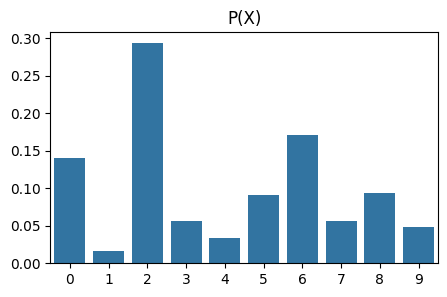
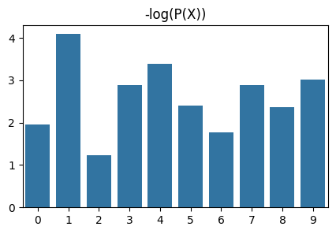
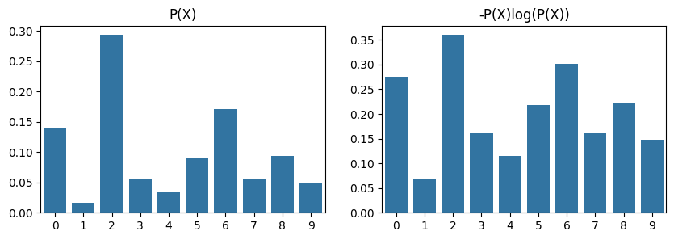
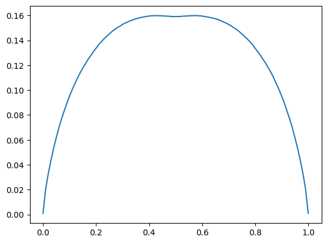
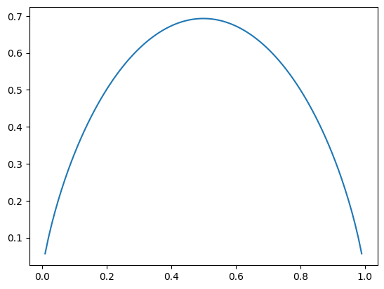

# Compression


<!-- WARNING: THIS FILE WAS AUTOGENERATED! DO NOT EDIT! -->

``` python
import torch
import matplotlib.pyplot as plt
import pandas as pd
import seaborn as sns
import numpy as np
```

## Uniform

In uniform case, I know nothing about the distribution of the event
assignments, so I need enough bits to help me decide amoung 10 choices.
That would be log<sub>2</sub>(10) = 3.4 bits. Note that 4 bits allows
representing 16 choices, and 3 bits 8. So hence the value.

``` python
np.log(10)/np.log(2)
```

    3.3219280948873626

``` python
n = 10
probs = torch.full((n,), 1/n)
probs
```

    tensor([0.1000, 0.1000, 0.1000, 0.1000, 0.1000, 0.1000, 0.1000, 0.1000, 0.1000,
            0.1000])

``` python
torch.log(probs)
```

    tensor([-2.3026, -2.3026, -2.3026, -2.3026, -2.3026, -2.3026, -2.3026, -2.3026,
            -2.3026, -2.3026])

``` python
-torch.sum(probs*torch.log(probs))
```

    tensor(2.3026)

Perplexity is 10, nice!

``` python
torch.exp(-torch.sum(probs*torch.log(probs)))
```

    tensor(10.0000)

Now let’s try computing entropy in bits instead:

``` python
-torch.sum(probs*torch.log(probs))/np.log(2)
```

    tensor(3.3219)

As you can see, we have recovered log<sub>2</sub>(10) = 3.4

``` python
np.log(2)
```

    0.6931471805599453

## Some plots

``` python
probs = torch.softmax(torch.randn(10), 0)
```

``` python
fig, ax = plt.subplots(1,1,figsize=(5,3))
sns.barplot(probs, ax=ax).set(title="P(X)")
```



``` python
fig, ax = plt.subplots(1,1,figsize=(5,3))
sns.barplot(-torch.log(probs), ax=ax).set(title="-log(P(X))")
```



``` python
fig, (ax1, ax2) = plt.subplots(1,2,figsize=(10,3))
sns.barplot(probs, ax=ax1).set(title="P(X)")
sns.barplot(-probs*torch.log(probs), ax=ax2).set(title="-P(X)log(P(X))")
```



``` python
import random
import zlib
```

``` python
s = ''.join(random.choices(['R', 'S'], [0.01, 0.99], k=1000))
s
```

    'SSSSSSSSSSSSSSSSSSSSSSSSSSSSRSSSSSSSSSSSSSSSSSSSSSSSSSSSSSSSSSSSSSSSSSSSSSSSSSSSSSSSSSSSSSSSSSSSSSSSSSSSSSSSSSSSRSSSSSSSSSSSSSSSSSSSSSSSSSSSSSSSSSSSSSSSSSSSSSSSSSSSSSSSSSSSSSSSSSSSSSSSSSSSSSSSSSSSSSSSSSSSSSSSSSSSSSSSSSSSSSSSSRSSSSSSSSSSSSSSSSSSSSSSSSSSSSSSSSSSSSSSSSSSSSSSSSSSSSSSSSSSSSSSSSSSSSSSSSSSSSSSSSSSSSSSSSSSSSSSSSSSSSSSSSSSSSSSSSSSSSSSSSSSSSSSSSSSSSSSSSSSSSSSSSSSSSSSRSSSSSSSSSSSSSSSSSSSSSSSSSSSSSSSSSSSSSSSSRSSSSSSSSSSSSSSSSSSSSSSSSSSSSSSSSSSSSSSSSSSSSSSSSSSSSSSSSSSSSSSSSSSSSSSSSSSSSSSSSSSSSSSSSSSSSSSSSSSSRSSSSSSSSSSSSSSSSSSSSSSSSSSSSSSSSSSSSSSSSSSSSSSSSSSSSRSSSSSSSSSSSSSSSSSSSSSSSSSSSSSSSSSSSSSSSSSSSSSSSSSSSSSSSSSSSSSSSSSSSSSSSSSSSSSSSSSSSSSSSSSSSSSSSSSSSSSSSSSSSSSSSSSSSSSSSSSSSSSSSSSSSSSSSSSSSSSSSSSSSSSRSSSSSSSSSSSSSSSSSSSSSSSSSSSSSSSSSSSSSSSRSSSSSSSSSSSSSSSSSSSSSSSSSSSSSSSSSSSSSSSSSSSSSSSSSSSSRSSSSSSSSSSSSSSSSSSSSSSSSSSSSSSSSSSSSSSSSSSSSSSSSSSSSSSSSSSSSSSSSSSSSSSSSSSSSSSSSSSSSSSSSSSSSSSSSSSSSSSSSSSSSSSSSSSSSSSSSSSSSSSSSSSSSSSSSSSSSSSSSSSSSSRSSSSSSSSSSSSSSSSSSSSSSSSSSSSSSSSSSSS'

``` python
len(zlib.compress(s.encode()))
```

    40

``` python
def compress_for(p, k=1000000):
    s = ''.join(random.choices(['R', 'S'], [p, 1-p], k=k))
    return len(zlib.compress(s.encode()))/k
```

``` python
ps = np.linspace(0,1,100)
```

``` python
np.zeros(10)
```

    array([0., 0., 0., 0., 0., 0., 0., 0., 0., 0.])

``` python
compression_trials = []
for trial in range(2):
    print(trial)
    compressions = []
    for p in ps:
        c = compress_for(p)
        compressions.append(c)
    compression_trials.append(compressions)
```

    0
    1

``` python
compression_ratio = np.average(np.array(compression_trials), 0)
```

``` python
plt.plot(ps,compression_ratio)
```



``` python
# inner p
ip = ps[1:-1]
```

``` python
entropy = - (ip*np.log(ip) + (1-ip)*np.log(1-ip))
```

``` python
plt.plot(ip,entropy)
```



``` python
plt.plot(entropy, compression_ratio[1:-1])
plt.xlabel("Entropy")
plt.ylabel("Compression ratio")
```

    Text(0, 0.5, 'Compression ratio')


